# TIMEFLOW — Architecture Map

## 1. High-Level Architecture

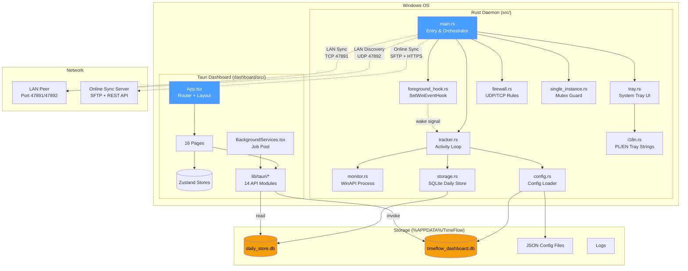

## 2. Daemon Thread Architecture

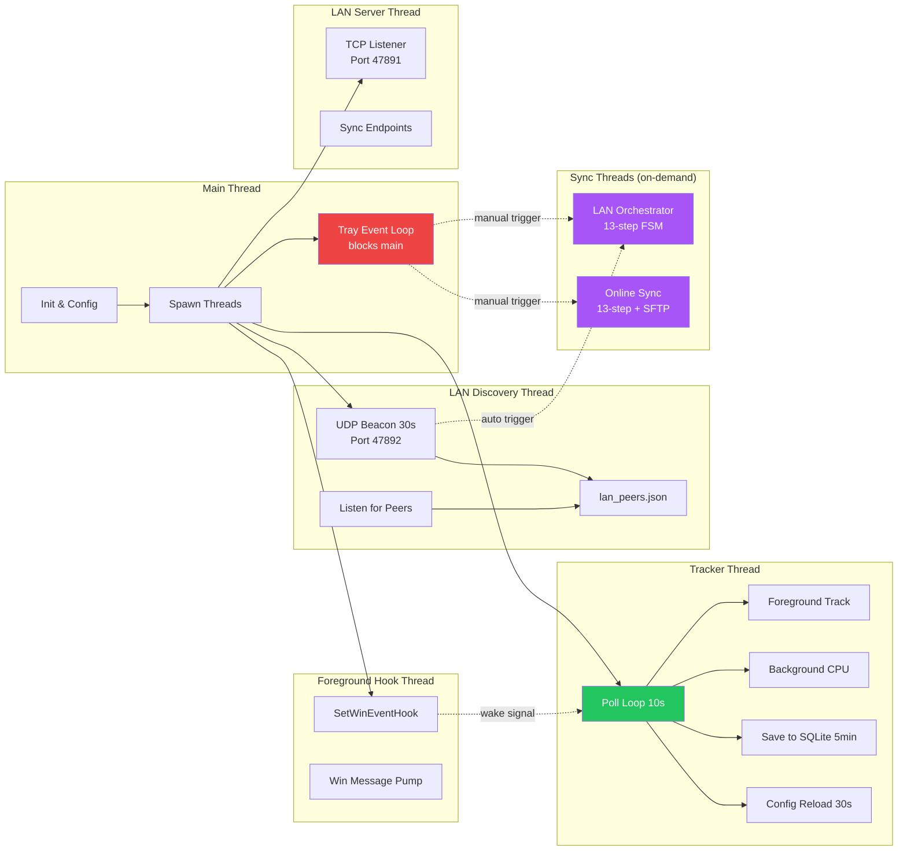

## 3. Daemon Data Flow (Monitor → Tracker → Storage)

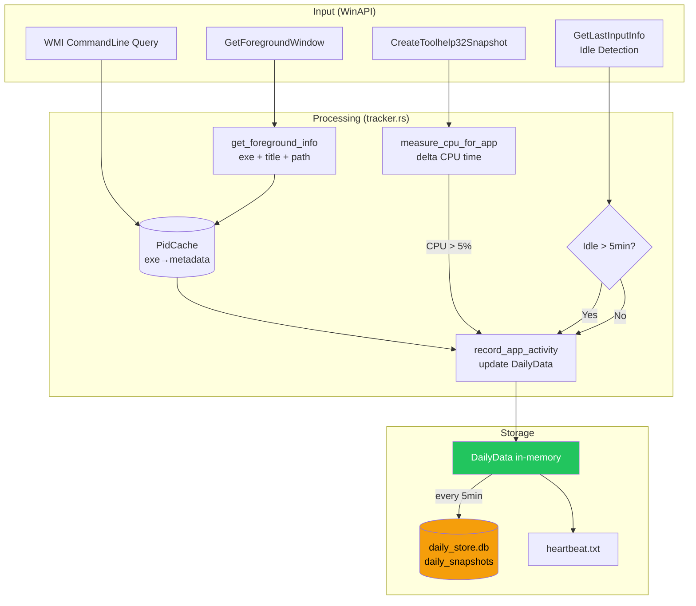

## 4. Dashboard Pages & Routing

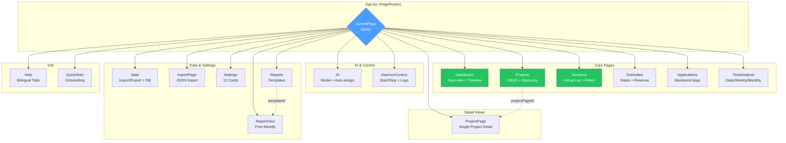

## 5. Dashboard State Management & Data Flow

```mermaid
flowchart TD
    subgraph "Zustand Stores"
        UI[useUIStore<br/>currentPage, focus states<br/>firstRun, pageGuard]
        DATA_S[useDataStore<br/>dateRange, timePreset<br/>refreshKey, autoImport]
        SETTINGS_S[useSettingsStore<br/>language, currency<br/>workingHours, animations]
        BG_STATUS[useBackgroundStatusStore<br/>daemonStatus, aiStatus<br/>unassigned counts]
        PROJ_CACHE[useProjectsCacheStore<br/>allTimeProjects<br/>lazy + invalidation]
    end

    subgraph "Custom Events"
        LOCAL_CHG["LOCAL_DATA_CHANGED<br/>(invokeMutation)"]
        APP_REF["APP_REFRESH<br/>(triggerRefresh)"]
        AI_DONE["AI_ASSIGNMENT_DONE"]
        SYNC_DONE["ONLINE/LAN_SYNC_DONE"]
        PROJ_INV["PROJECTS_ALL_TIME<br/>_INVALIDATED"]
    end

    subgraph "Tauri API Layer (14 modules)"
        T_PROJ[projectsApi]
        T_SESS[sessionsApi]
        T_DASH[dashboardApi]
        T_DAEMON[daemonApi]
        T_AI[aiApi]
        T_APPS[applicationsApi]
        T_MANUAL[manualSessionsApi]
        T_DATA[dataApi]
        T_DB[databaseApi]
        T_SET[settingsApi]
        T_LAN[lanSyncApi]
        T_ONLINE[daemonOnlineSyncApi]
        T_LOG[logManagementApi]
    end

    subgraph "Tauri Backend"
        BACKEND["Tauri Commands<br/>(Rust)"]
    end

    T_PROJ & T_SESS & T_DASH & T_DAEMON & T_AI & T_APPS & T_MANUAL & T_DATA & T_DB & T_SET & T_LAN & T_ONLINE & T_LOG -->|invoke / invokeMutation| BACKEND

    BACKEND -->|result| T_PROJ & T_SESS & T_DASH

    LOCAL_CHG --> PROJ_CACHE
    LOCAL_CHG --> BG_STATUS
    APP_REF --> PROJ_CACHE
    PROJ_INV --> PROJ_CACHE
    AI_DONE -.->|toast| UI
    SYNC_DONE -.->|toast| UI

    DATA_S -->|triggerRefresh| APP_REF

    style UI fill:#818cf8,color:#fff
    style DATA_S fill:#818cf8,color:#fff
    style SETTINGS_S fill:#818cf8,color:#fff
    style BG_STATUS fill:#818cf8,color:#fff
    style PROJ_CACHE fill:#818cf8,color:#fff
    style BACKEND fill:#4a9eff,color:#fff
```

## 6. Background Services Job Pool

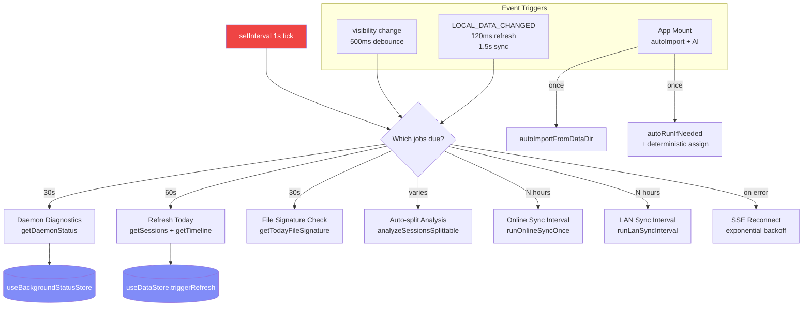

## 7. Sync Architecture

### 7a. LAN Sync

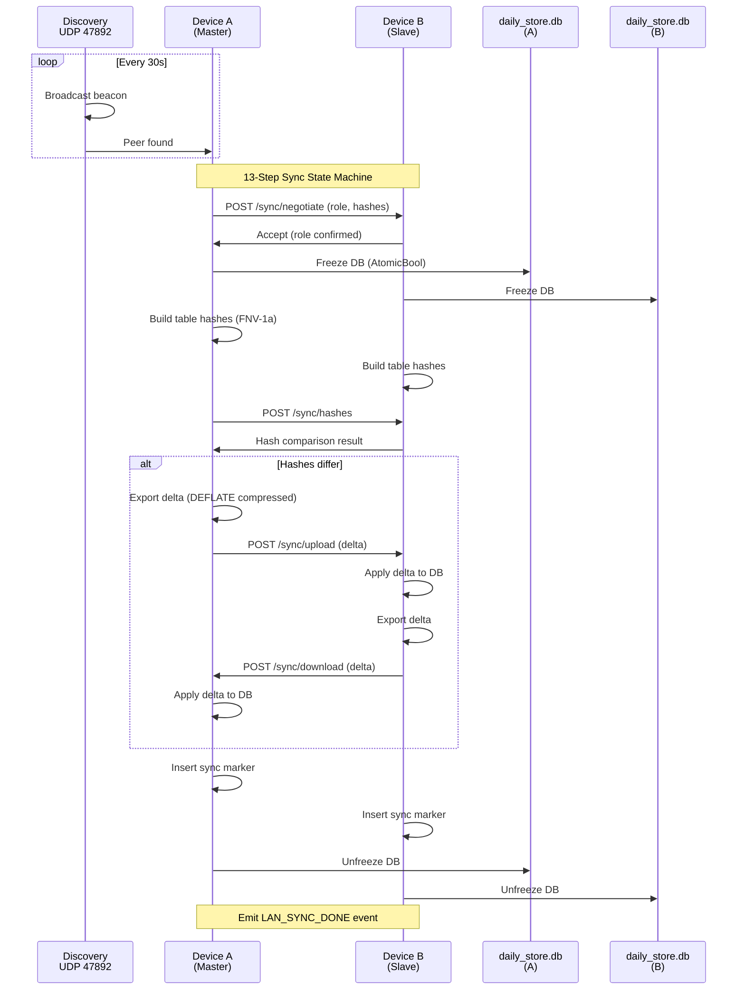

### 7b. Online Sync

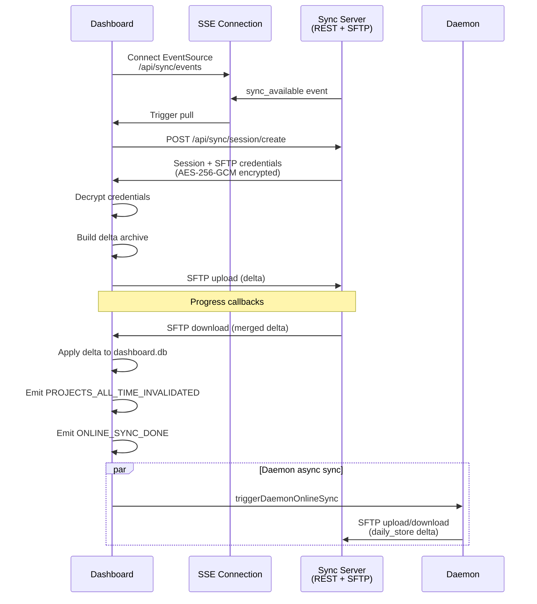

## 8. File & Storage Map

```mermaid
graph TD
    subgraph "%APPDATA%/TimeFlow/"
        subgraph "Databases"
            DASH_DB[(timeflow_dashboard.db<br/>Projects, Apps, Sessions<br/>Manual Sessions, Settings)]
            DAILY_DB[(data/daily_store.db<br/>daily_snapshots JSON<br/>sync_markers)]
        end

        subgraph "Config (JSON) — Dashboard writes, Daemon reads"
            MON_APPS[monitored_apps.json]
            LAN_SET[lan_sync_settings.json]
            ONLINE_SET[online_sync_settings.json]
            LOG_SET[log_settings.json]
            LANG[language.json]
        end

        subgraph "State Files"
            DEVICE[device_id.txt<br/>generated once]
            HB[heartbeat.txt<br/>every 10s]
            PEERS[lan_peers.json<br/>every 30s]
        end

        subgraph "Logs"
            DAEMON_LOG[logs/daemon.log]
            LAN_LOG[logs/lan_sync.log]
        end

        subgraph "Backup & Archive"
            BACKUP[sync_backups/<br/>max 5 .db files]
            ARCHIVE[archive/<br/>daily snapshots]
            IMPORT_DIR[import/<br/>temp import files]
        end
    end

    subgraph "Writers"
        D[Daemon]
        DASH[Dashboard]
    end

    D -->|RW| DAILY_DB
    D -->|R| DASH_DB
    D -->|R| MON_APPS & LAN_SET & ONLINE_SET & LOG_SET & LANG
    D -->|W| HB & PEERS & DEVICE
    D -->|W| DAEMON_LOG & LAN_LOG
    D -->|W| BACKUP

    DASH -->|RW| DASH_DB
    DASH -->|R| DAILY_DB
    DASH -->|W| MON_APPS & LAN_SET & ONLINE_SET & LOG_SET & LANG
    DASH -->|R| PEERS
    DASH -->|RW| ARCHIVE & IMPORT_DIR

    style DASH_DB fill:#f59e0b,color:#000
    style DAILY_DB fill:#f59e0b,color:#000
    style D fill:#ef4444,color:#fff
    style DASH fill:#4a9eff,color:#fff
```

## 9. Component Hierarchy (Dashboard)

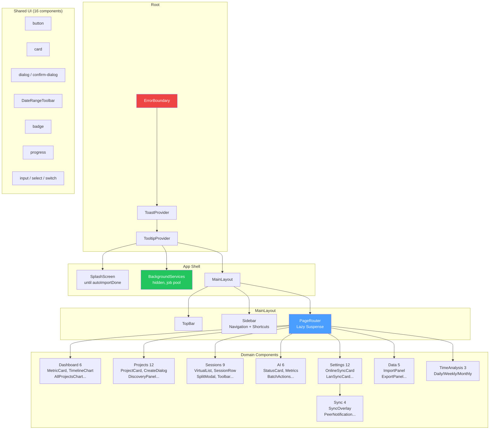

## 10. Hooks & Data Fetching

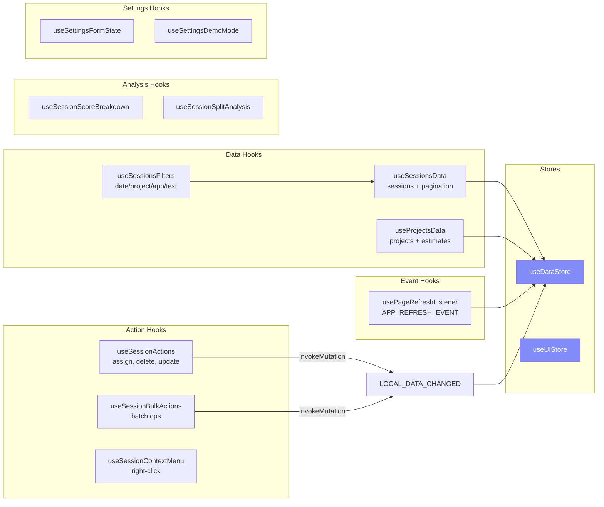
