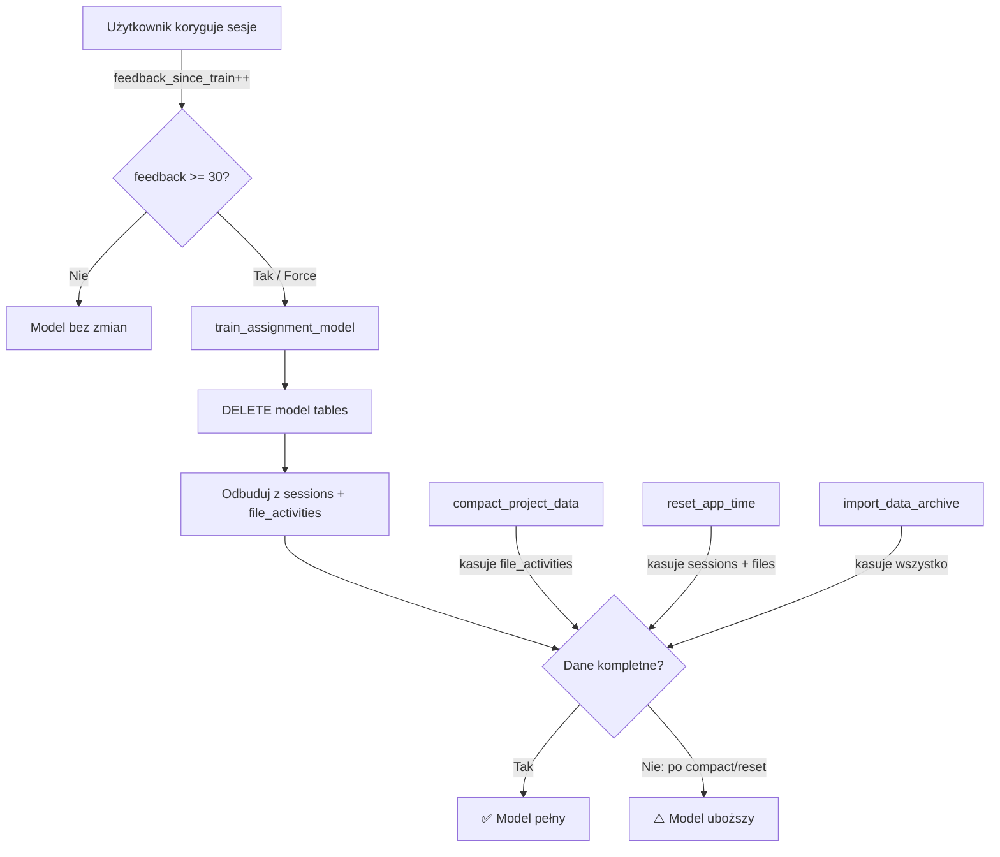

# Analiza: Dlaczego AI traci wiedzę?

## Podsumowanie

**Tak, AI „zapomina" — ale nie dlatego, że ktoś kasuje wyuczone dane. Problem jest architekturalny: model jest odbudowywany od zera przy każdym retreningu** na podstawie surowych danych ([sessions](file:///f:/___APPS/__TimeFlow/__client/dashboard/src-tauri/src/commands/import_data.rs#745-764), `file_activities`). Jeśli te surowe dane zostały wcześniej usunięte (kompakcja, reset, sync), to retrenowany model jest uboższy.

## Jak działa AI w TimeFlow

Model przypisywania projektów korzysta z 3 tabel wag:

| Tabela | Co przechowuje | Waga w score |
|---|---|---|
| `assignment_model_app` | ile razy app_id ↔ project_id | 50% |
| `assignment_model_time` | godzina + dzień tygodnia ↔ project | 15% |
| `assignment_model_token` | tokeny z nazw plików ↔ project | 30% (+ 5% margin) |

Retrenowanie ([train_assignment_model](file:///f:/___APPS/__TimeFlow/__client/dashboard/src-tauri/src/commands/assignment_model.rs#L538-L651)):
1. **Kasuje** wszystkie tabele modelowe (`DELETE FROM assignment_model_app/time/token`)
2. **Odbudowuje** je od zera na podstawie:
   - `sessions WHERE project_id IS NOT NULL`  
   - `file_activities WHERE project_id IS NOT NULL`

## Ścieżki utraty danych treningowych

### 🔴 Krytyczne — bezpośrednio niszczą wiedzę po retreningu

#### 1. Compact Project Data
- **Co robi**: `DELETE FROM file_activities WHERE project_id = ?1`
- **Efekt**: Po kompakcji i retreningu model traci **wszystkie tokeny plików** dla tego projektu (30% siły predykcji).
- **Lokalizacja**: [compact_project_data](file:///f:/___APPS/__TimeFlow/__client/dashboard/src-tauri/src/commands/projects.rs#L1293-L1301)

#### 2. Reset App Time
- **Co robi**: Kasuje [sessions](file:///f:/___APPS/__TimeFlow/__client/dashboard/src-tauri/src/commands/import_data.rs#745-764) + `file_activities` dla danej aplikacji
- **Efekt**: Model traci wiedzę app→project i tokeny dla tej apki.
- **Lokalizacja**: [reset_app_time](file:///f:/___APPS/__TimeFlow/__client/dashboard/src-tauri/src/commands/settings.rs#L140-L150)

#### 3. Reset Project Time
- **Co robi**: Kasuje sesje+pliki wszystkich apek danego projektu
- **Efekt**: Całkowita utrata wiedzy o projekcie po retreningu.
- **Lokalizacja**: [reset_project_time](file:///f:/___APPS/__TimeFlow/__client/dashboard/src-tauri/src/commands/settings.rs#L228-L244)

#### 4. Sync Import ([import_data_archive](file:///f:/___APPS/__TimeFlow/__client/dashboard/src-tauri/src/commands/import_data.rs#410-477))
- **Co robi**: `DELETE FROM` na WSZYSTKICH tabelach (w tym modelowych), potem reimport z archiwum
- **Efekt**: **Totalna utrata modelu**. Reimportowane dane nie zawierają modelu — musi być retrenowany od nowa.
- **Lokalizacja**: [import_data_archive](file:///f:/___APPS/__TimeFlow/__client/dashboard/src-tauri/src/commands/import_data.rs#L410-L476)

### 🟡 Częściowe — niszczą model selektywnie

#### 5. Delete App & Data
- **Co robi**: Kasuje `assignment_model_app` + `assignment_model_time` dla app_id, + sesje + pliki
- **Efekt**: Natychmiast traci model dla tej apki. Poprawne zachowanie.
- **Lokalizacja**: [delete_app_and_data](file:///f:/___APPS/__TimeFlow/__client/dashboard/src-tauri/src/commands/settings.rs#L178-L226)

### 🟢 Nieszkodliwe — model nie jest naruszany

- **[optimize_database_internal](file:///f:/___APPS/__TimeFlow/__client/dashboard/src-tauri/src/db.rs#661-687)** — jedynie VACUUM/checkpoint, nie kasuje danych
- **[clear_all_data](file:///f:/___APPS/__TimeFlow/__client/dashboard/src-tauri/src/commands/settings.rs#246-269)** — kasuje wszystko włącznie z modelem, ale to celowa operacja "factory reset"

## Główne odkrycie

> **Retrenowanie nie jest automatyczne.** Model retrenuje się dopiero po **30 feedbackach** (zmian projektu), chyba że użytkownik wymusi retrenowanie ręcznie na stronie AI.

To oznacza taki scenariusz:

1. Użytkownik kompaktuje projekt (kasuje `file_activities`)
2. Model nadal działa dobrze (stare wagi w tabelach)
3. Po 30 korektach następuje retrenowanie
4. Model jest odbudowywany od zera — ale `file_activities` już nie istnieją
5. **Model zapomina** tokeny i traci 30% siły predykcji

## Diagram przepływu

## Zalecane poprawki

Jeśli chcesz, mogę przygotować plan naprawy. Oto 3 podejścia od prostego do zaawansowanego:

### Opcja A: Retrenuj natychmiast po destrukcyjnych operacjach
- Po [compact_project_data](file:///f:/___APPS/__TimeFlow/__client/dashboard/src-tauri/src/commands/projects.rs#1292-1302), [reset_app_time](file:///f:/___APPS/__TimeFlow/__client/dashboard/src-tauri/src/commands/settings.rs#140-151), [reset_project_time](file:///f:/___APPS/__TimeFlow/__client/dashboard/src-tauri/src/commands/settings.rs#228-245) — automatycznie wywołaj [train_assignment_model(force=true)](file:///f:/___APPS/__TimeFlow/__client/dashboard/src-tauri/src/commands/assignment_model.rs#538-652)
- **Pro**: proste, model jest zawsze spójny ze stanem danych
- **Con**: nie odzyskuje skasowanej wiedzy, jedynie model szybciej odzwierciedla aktualny stan

### Opcja B: Nie kasuj model tables przy retreningu — merguj
- Zamiast `DELETE FROM + INSERT`, użyj `INSERT OR REPLACE` / aktualizacja przyrostowa
- Stare dane z modelu przetrwają nawet po skasowaniu surowych danych
- **Pro**: model zachowuje historyczną wiedzę
- **Con**: model może mieć "zombie" wpisy dla skasowanych projektów

### Opcja C: Osobna tabela z historią (nigdy nie kasowana)
- Dodaj `assignment_model_history` jako trwałą pamięć
- Przy retreningu merguj historię + aktualne dane
- **Pro**: najlepsze zachowanie wiedzy
- **Con**: większa złożoność
